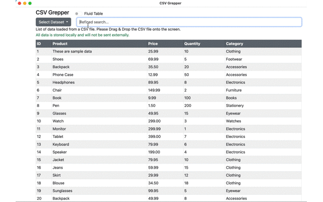

# CSV Grepper

<div align="left">
  
</div>

CSV Grepper is an Electron-based application that allows you to store CSV data in the local machine's Local Storage and search it easily.

##  Features
It converts CSV data into a table and stores it in Local Storage, without sending it externally.

You can easily refine search results in the table.  
This makes it easier to search than directly searching the CSV file.

Please Drag & Drop the CSV file onto the screen.

You can specify multiple keywords for searching, separated by spaces.

<div align="center">
  
</div>

## Install

You can obtain the pre-built .app file from the [Release page](https://github.com/knziiy/CSVGrepper/releases). 


## Build

```bash
npm i
npm run make
```

## Author & License

* knziiy
* License:  
  MIT (see LICENSE)
  
